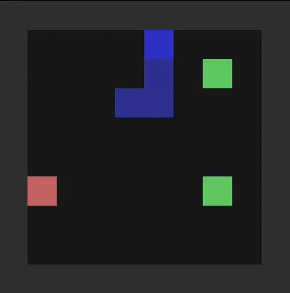

# learn2slither

Hi! This is my 42 cursus project, learn2slither.
The objective was to create a snake AI that can achieve at least 10 of size in a 10x10 board 50% of the time
using Q-learning reinforcement learning algorithm.

## Usage

> [!NOTE]
> To run the program from source, you need to have `uv` installed on your system.
> https://docs.astral.sh/uv/getting-started/installation/

```bash
uv run sources/main.py --help
```

## Result

In a 10x10 board with **1000** sessions, the AI agent average a length of **24.32** and has got a maximum length of **54**.


