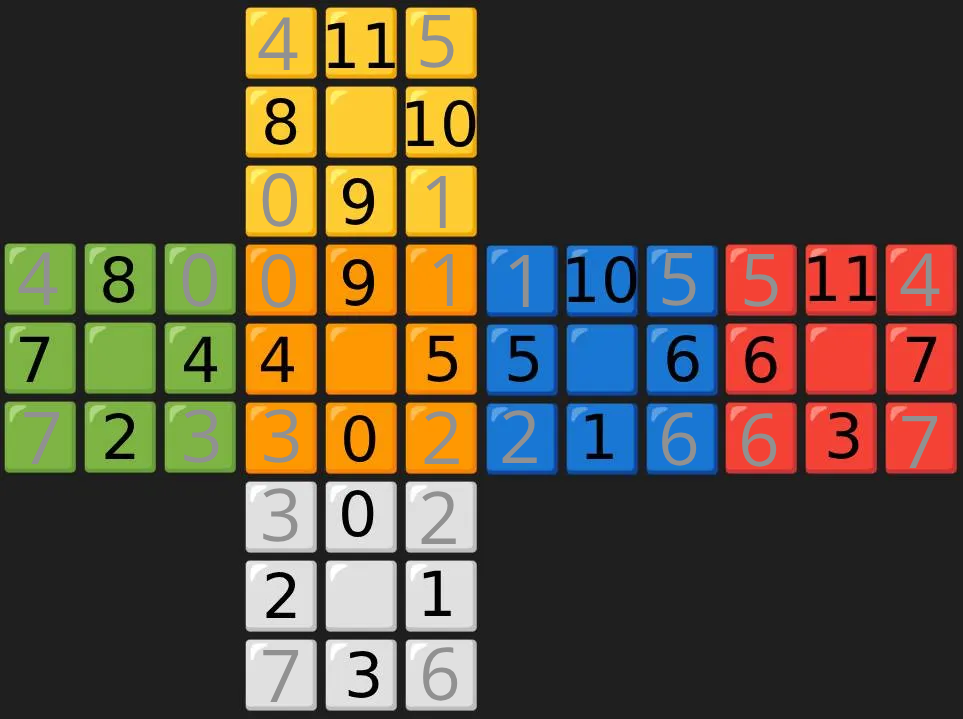

# rubik

Hi! This is my 42 cursus project, rubik developed with the help of [Focus](https://github.com/Focuuus).
The objective was to create a 3x3 Rubik's Cube solver that achieves an average solution in 50 moves and under 3 seconds.

## Usage

> [!NOTE]
> To run the program from source, you need to have `uv` installed on your system.
> https://docs.astral.sh/uv/getting-started/installation/

```bash
uv run sources/main.py --help
```

To generate lookup tables
```bash
uv run -m sources.rubik
mv phase_*.table ./includes/
```

## Explanations

> [!WARNING]
> I am not an expert in mathematics, particularly in group theory.

This project uses Thistlethwaite’s 52-move algorithm but with a key difference: instead of pruning tables, we created lookup tables.
The algorithm divides the cube’s solving process into five groups (G0, G1, G2, G3, G4).
Each group represents a specific cube state where a meaningful constraint is satisfied.
For example, G0 includes all possible cube states, while G1 includes only those where all edges are correctly oriented.

Thistlethwaite demonstrated that each group can transition to the next without undoing the progress made in the previous phase.
This is achieved by restricting the allowed moves between phases.

The groups and their allowed moves are defined as follows
```bash
G0 = {L, R, F, B, U, D}
G1 = {L, R, F, B, U2, D2}
G2 = {L, R, F2, B2, U2, D2}
G3 = {L2, R2, F2, B2, U2, D2}
G4 = {I}
```

### Lookup tables
Lookup tables are generated by enumerating all cube states that satisfy the constraints of a given group.
A [breadth-first search](https://en.wikipedia.org/wiki/Breadth-first_search) algorithm is used to explore and record these states systematically.
Each new state is stored with its state, current depth and the sequence of moves required to return to the original cube state that already satisfies the given group’s constraints.

### Phase 1
Here, the goal is to transition from G0 to G1, ensuring all edges are correctly oriented.
To represent the edge orientation, each edge is encoded as a bit: `0` for correct orientation and `1` for incorrect orientation.
A 3x3 cube has 12 edges, so the edge orientation can be represented as a 12-bit binary number.
This binary number is then converted to a base-10 integer, providing a unique identifier for the cube state in this phase.
Since there are 12 edges, there are $2^{12}$ possible states.
However, due to cube parity constraints, only half of these states are valid, resulting in $2^{11}$ possible states.

### Phase 2
Here, the goal is to transition from G1 to G2, ensuring that corners are correctly oriented and that the edges `FU`, `FD`, `BU` and `BD` are in there correct slice.
We need to encode 2 thing here and we can start by encoding corners orientation.
To do that we can use the same method used in [phase 1](#Phase-1) but because a corner has 3 colors we need to encode it in base 3.
Because there is 8 corners in a 3x3 cube, that mean that we have $3^{8}$ possible states.

### Phase 3
Todo...

### Phase 4
Todo...

### Encoding


## Result

In a **5000** cube shuffle, we achieved an average of **30.61** moves, with an average solution time of **0.26** seconds.

## Ressources

[Thistlethwaite base paper](https://www.jaapsch.net/puzzles/thistle.htm)

[Drew Finnis implementation](https://github.com/dfinnis/Rubik/tree/master)

[Stefan Pochmann implementation](https://www.stefan-pochmann.info/spocc/other_stuff/tools/solver_thistlethwaite/solver_thistlethwaite.txt)

[Quassnoi implementation](https://explainextended.com/2022/12/31/happy-new-year-14/)

[Rohan StackExchange post](https://math.stackexchange.com/questions/1362471/rubiks-cube-thistlethwaite-four-phase-algorithm)

[Tetrad twist explanation](https://puzzling.stackexchange.com/questions/5402/what-is-the-meaning-of-a-tetrad-twist-in-thistlethwaites-algorithm)
