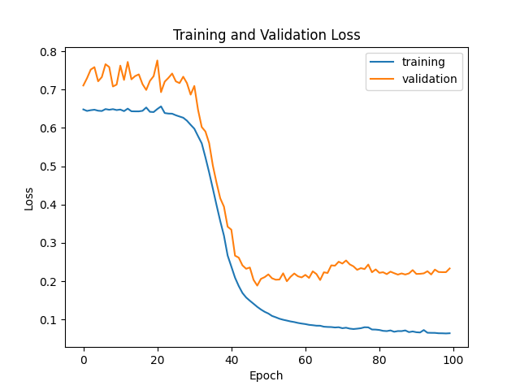
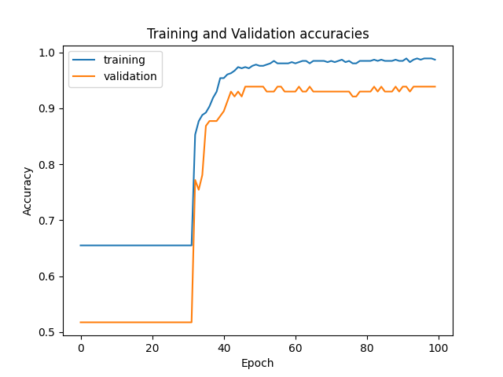

# multilayer_perceptron

Hi! This is my 42 cursus project, multilayer_perceptron. The objective was to implement a multilayer perceptron from scratch and use it to make predictions on a breast cancer dataset.

## Usage

> [!NOTE]
> To run the program from source, you need to have `uv` installed on your system.
> https://docs.astral.sh/uv/getting-started/installation/

```bash
uv run sources/main.py --help
uv run sources/main.py split --help
uv run sources/main.py train --help
uv run sources/main.py predict --help
```

## Result



